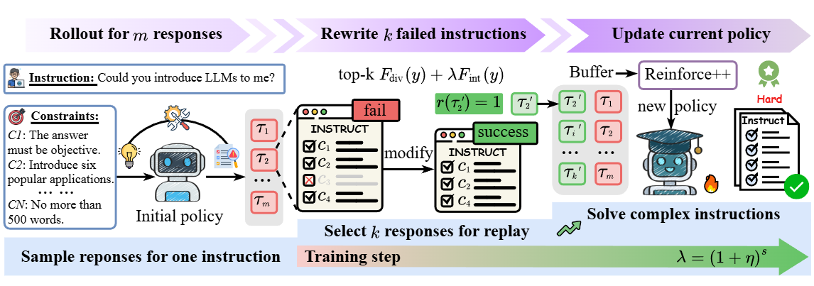

<h2>Replay Failures as Successes: Sample-Efficient Reinforcement Learning for Instruction Following</h2>

<!-- TODO:  Thread,Paper,Dataset,Weights-->

## Overview
Reinforcement Learning (RL) has shown promise for aligning Large Language Models (LLMs) to follow instructions with various constraints. Despite the encouraging results, RL improvement inevitably relies on sampling successful, high-quality responses; however, the initial model often struggles to generate responses that satisfy all constraints due to its limited capabilities, yielding sparse or indistinguishable rewards that impede learning. In this work, we propose ***H***indsight ***i***nstruction ***R***eplay (HiR), a novel sample-efficient RL framework for complex instruction following tasks, which employs a *select*-then-*rewrite* strategy to *replay failed attempts as successes* based on the constraints that have been satisfied in hindsight. We perform RL on these replayed samples as well as the original ones, theoretically framing the objective as dual-preference learning at both the instruction- and response-level to enable efficient optimization using only a binary reward signal.

## Acknowledgement
We thank the [verl](https://github.com/volcengine/verl) for providing the awesome open-source RL infrastructure. We also thank the developers of [Qwen](https://github.com/QwenLM) and [Llama](https://github.com/meta-llama) for their awesome open-source models.
